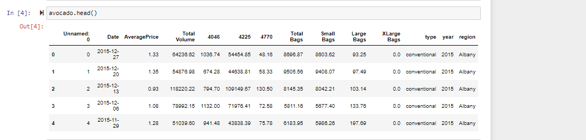
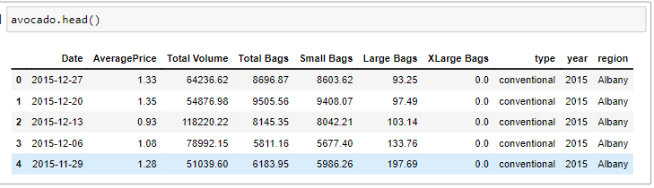

# Avocado-Linear-Regression

## Introduction
In order to better understand linear regression, I decided to play around with a data set I found on Kaggle. 
The data set can be found here. https://www.kaggle.com/datasets/neuromusic/avocado-prices

## Exploratory Data Analysis
After importing the data set with pandas this is what our dataframe looks like. 

The following features aren't interesting to us, so we will just go ahead and drop them for now. 

#### Features we will be dropping
- **Unnamed:0**
- **4046 (Total number of avocados with PLU 4046 sold)**
- **4225 (Total number of avocados with PLU 4225 sold)**
- **4770 (Total number of avocados with PLU 4770 sold)**

After dropping those features, our data set now looks like this. 

## References:

1. https://www.kaggle.com/datasets/neuromusic/avocado-prices

2. 